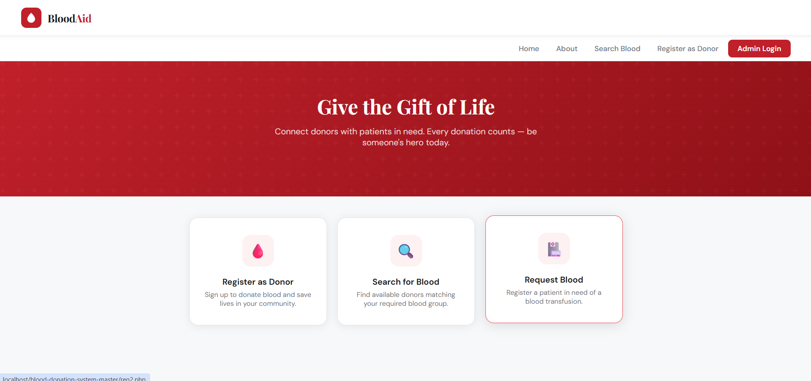

# Blood Donation Management System

A web-based Blood Donation Management System developed using PHP and MySQL.
## Screenshots

### Home Page

## Features

- Donor Registration
- Patient Registration
- Blood Search
- Donation Management
- Admin Login
- Donor and Patient Records

## Technologies Used

- PHP
- MySQL
- HTML
- CSS
- JavaScript

## Installation

1. Install XAMPP
2. Copy project to htdocs
3. Import database into phpMyAdmin
4. Start Apache and MySQL
5. Open project in browser

## Author

Tanvi Chaudhari
